# Aegean Experience - HTML & CSS Project
In order to view the live site, click [here](https://alexgcbn.github.io/CI_PP1_AEGEAN_EXPERIENCE/).

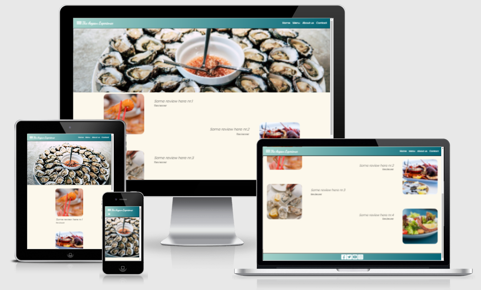

The Aegean Experience is a website that intends to provide users with the appropriate information about the restaurant with the same name, both in text and images. As it is a restaurant's webpage, there was further scope than just the basic intent. The webpage strives to provide visitors with easy to find information, along with visual content that looks appetizing. It is also important to keep the page's style as close to the "sea" or "greek" style as possible, to provide the appropriate feeling to the visitor.
* The restaurant was imagined during the website creation and thus most of the information provided is a mock-up, that could be replaced in case it would be used for commercial purposes.

## User Stories:

### As a first time user, I want to:
1. See photos of some meals.
2. Know where the restaurant is located.
3. See how I can contact the restaurant.
4. Learn more about the restaurant's origin and creator.
5. See the restaurant operating hours.
6. See the menu.

### As a recurring user, I want to:
7. Be able to easily provide feedback.
8. Have an easy way to contact the restaurant for reservations or information.
9. Have links to the restaurant's social media pages.
10. See what critics thought about the place.

### As the website owner, I want to:
11. Provide visitors with information about the restaurant's origins and leadership.
12. Have a way to easily navigate the website.
13. Showcase the restaurant's dedication to fresh ingredients.

## Goals:
### Development goals:
* Have a fully functional and accessible website.
* Provide a consistent experience throughout the pages.
* Have a consistent style throughout the pages.
* Provide easily accessible information.
* Have a simple yet intuitive design.

### Target audience goals:
* Provide an appropriately themed style for a Greek restaurant, for people that are interested in the experience.
* Have easy to find information so visitors can contact the restaurant.
* Have an easy to find location section.
* Showcase appetizing dishes to provide appropriate stimuli.

## Features:

### Pages:
We have a total of 4 pages on the website, which include the below features.

### Navbar:
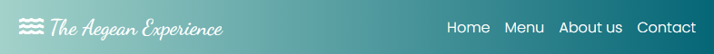
* The website navbar features the restaurant name and logo and links to the 4 pages.
* It is fully responsive, as it turns to a "hamburger" menu on medium to small screens.
* It is featured on all 4 pages, along with the 404 error page.
* The current page is underlined with a thick line.
* The hovered over page is underlined in a thinner line.  

#### User stories covered:

### Carousel:
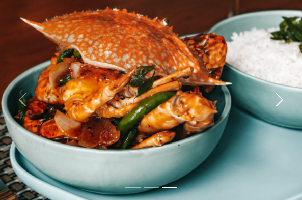
* The carousel provides the option to showcase images on the main page.
* 3 images have been added with the support for more.
* It is fully responsive and the image gets resized accordingly. For large screens the image is resized up to a point to maintain quality.  

#### User stories covered:

### Review section:
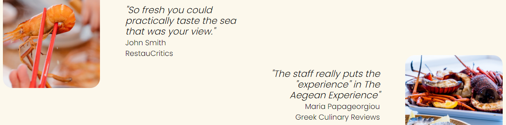
* The review section provides users with some mock-up reviews and images.
* It is a point of referrence to have a general idea of what other people think about the restaurant.  

#### User stories covered:

### Menu:
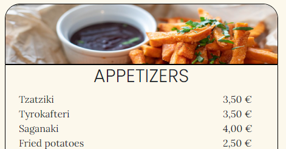
* The menu was designed with simplicity in mind, providing easy to find information with an appropriate theme.
* It has a consistent style.
* It is responsive, as its elements become smaller for medium to small screens.  

#### User stories covered:

### About us page:
#### Our Story
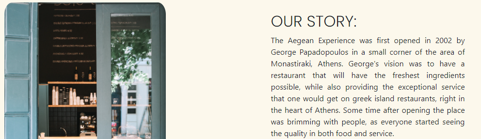
* Short story on how the restaurant was created.
* Features an image of the restaurant entrance.  

#### User stories covered:

#### Our chef
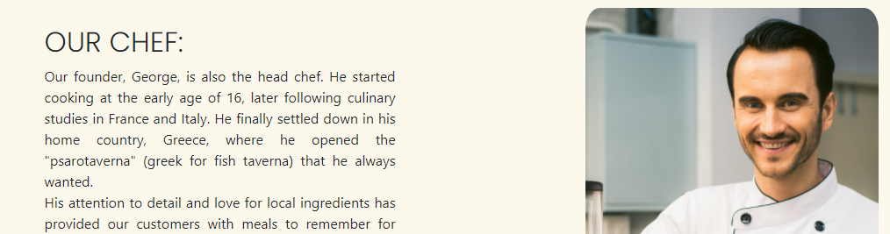
* Short bio on the restaurant's chef.
* Features a portrait of the chef.  

#### User stories covered:

#### The island
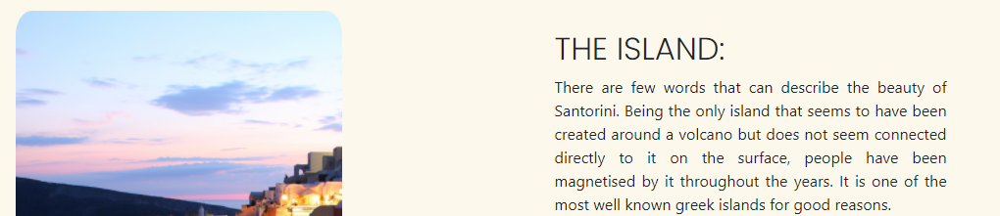
* Short introduction to the location of the restaurant, Oia, on Santorini island.
* Features a photo of Oia.  

#### User stories covered:

#### The ingredients
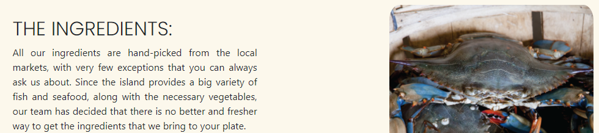
* The restaurant's dedication to the ingredients, explained for all customers.
* Features a photo of some ingredients (crabs)  

#### User stories covered:

### Contact us page:
#### Feedback form
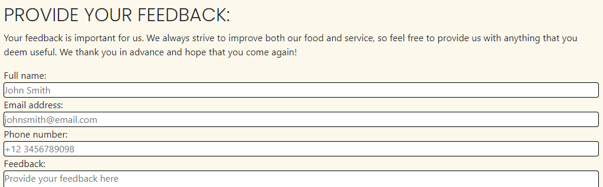
* Provides visitors with the option of sending in their feedback or questions.
* Has a dedication and a privacy statement.  

#### User stories covered:

#### Google maps iFrame
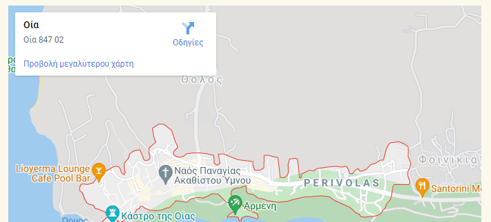
* Provides visitors with the location of the restaurants. (Current version provides the location of Oia, the town where the restaurant would be, as the restaurant is not real)
* Is embedded correctly to clearly show that it is a Google maps iFrame.  

#### User stories covered:

#### Contact details
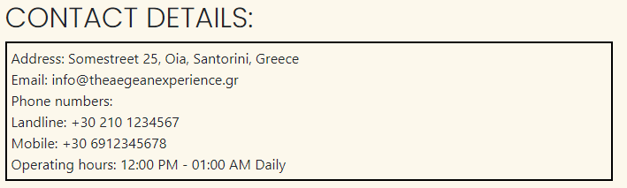
* Provides visitors with all necessary information to contact the restaurant.
* Has operating hours.  

#### User stories covered:

### Footer:

* Is positioned at the bottom of all pages.
* Provides easy to use links to social media that open in separate tabs.  

#### User stories covered:

## Testing:
### Validation

 HTML 

The W3C Markup Validation Service was used to validate HTML code. All pages passed with no errors or warnings to show.

### Home:

### Menu:
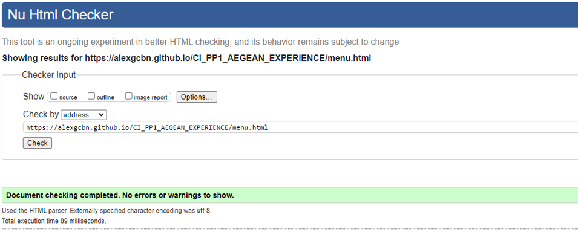

### About us:
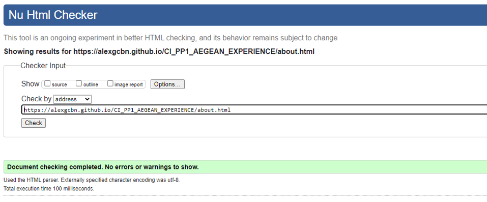

### Contact us:
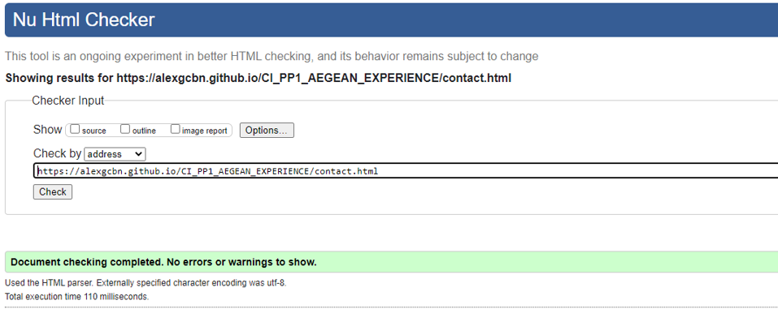

 CSS 

The W3C CSS Validation Service (Jigsaw) was used to validate CSS code.   
When performing the URI validation, we get 12 errors and many warnings. Those errors and warnings are related to Bootstrap.  
If we perform the code validation, we can see that there are no errors or warnings, as seen in the images below.  

### URI validation:
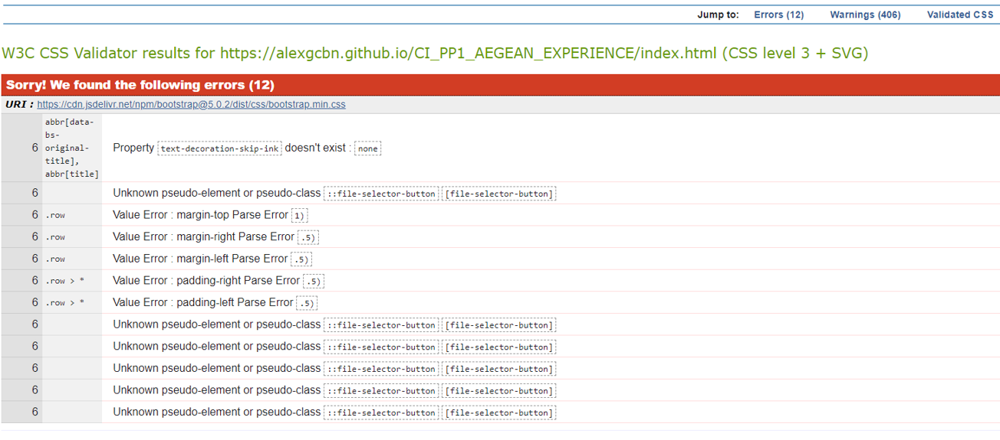

### Code validation:
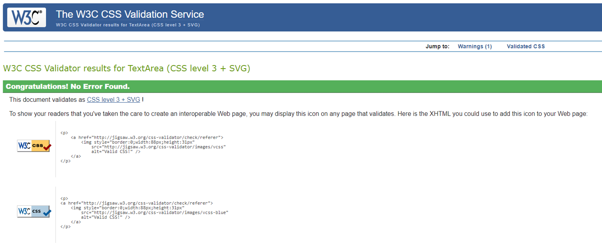

 Performance 

Website performance was tested with Google Developer Tools Lighthouse.   
All pages passed the tests with near perfect results.

### Home:
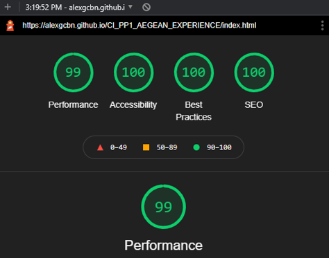

### Menu:

### About us:
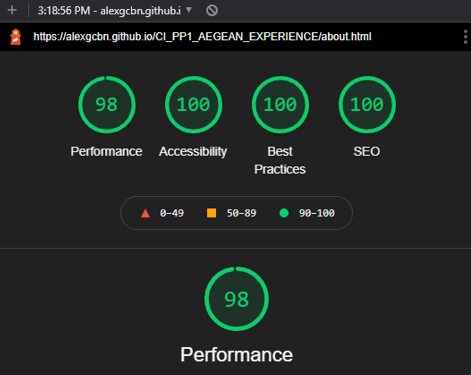

### Contact us:
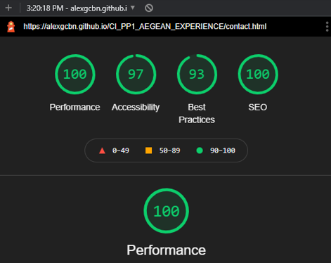

 Accessibility 

Website accessibility was tested with the WAVE Web Accessibility Evaluation Tool.  
All pages passed with no errors. 

### Home:
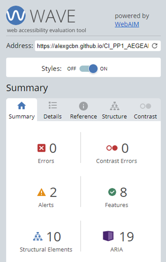

### Menu:

### About us:
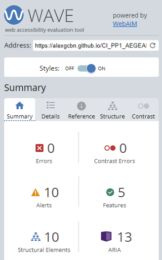

### Contact us:
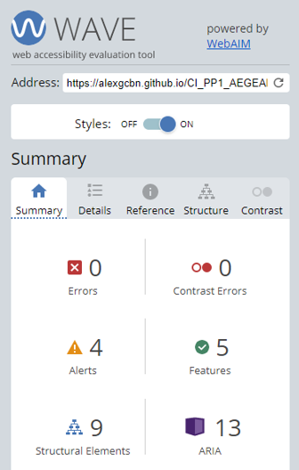

### Device and browser testing

The website was tested on the following devices:
* Windows desktop PC (various components) running Windows 10
  * Chrome Version 92.0.4515.159
  * Edge Version 92.0.902.78
* iPhone 12 Pro
  * Safari 
* Various devices from users who tested for feedback

The webpage works great on all devices and browsers that it was tested on.  
Functionality between desktop and mobile remains the same, with the look of the page changing slightly.  
As the website was designed mobile-first, it fits mobile browsers perfectly while also changing to fit a larger screen and occupy more space.

## Bugs

1. Footer did not stay on the bottom of screen.
   * Fixed by adding a container for all content which has the full viewport height (100vh), minus the footer height.
2. Carousel would clip images when transitioning.
   * Fixed by changing the transition to a fade-out.
3. When navbar links had a bottom border added for hover effect, they would move slightly up when hovered.
   * Fixed by adding an invisible bottom border.

## Deployment:
* The site was deployed to GitHub pages. The steps to deploy are as follows: 
  * In the GitHub repository, navigate to the Settings tab 
  * From the source section drop-down menu, select the Master Branch
  * Once the master branch has been selected, the page will be automatically refreshed with a detailed ribbon display to indicate the successful deployment. 

The live link can be found here - https://alexgcbn.github.io/CI_PP1_AEGEAN_EXPERIENCE/

## Credits:

* All images were downloaded from [Pexels](https://www.pexels.com/), from various artists.
* Icons used in the logo and footer were linked from [FontAwesome](https://fontawesome.com/).
* Footer idea was derived from the [Love Running](https://github.com/AlexGCbn/love-running) project, from [Code Institute](https://codeinstitute.net/)
* The website [Navbar](https://getbootstrap.com/docs/5.0/components/navbar/) and [Carousel](https://getbootstrap.com/docs/5.0/components/carousel/) features and code were taken from their respective Bootstrap websites.
* Steps on how to link the 404 page were found in [this GitHub post](https://docs.github.com/en/pages/getting-started-with-github-pages/creating-a-custom-404-page-for-your-github-pages-site)